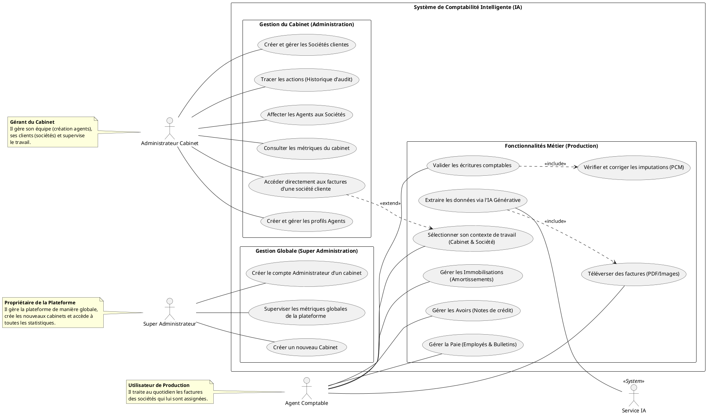
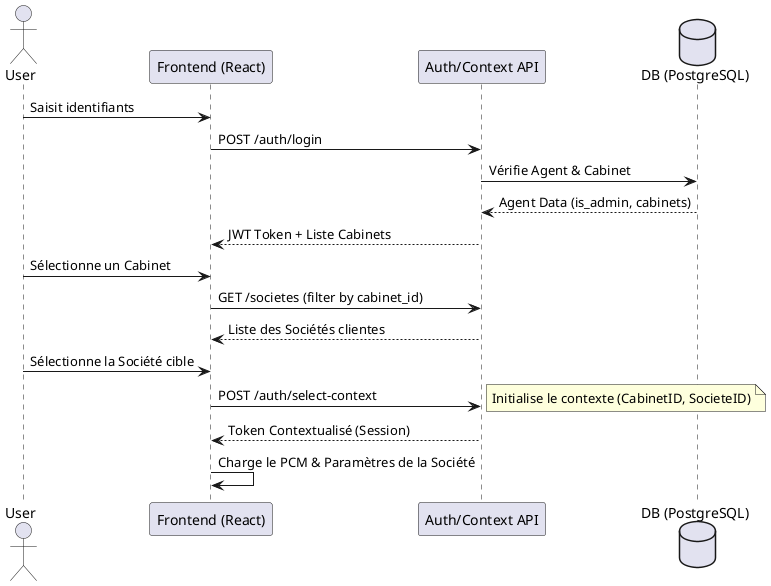
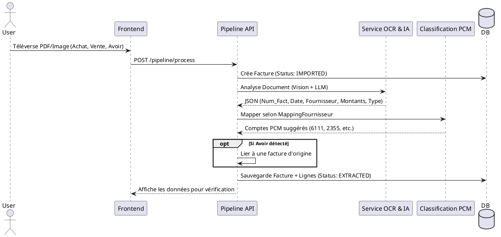
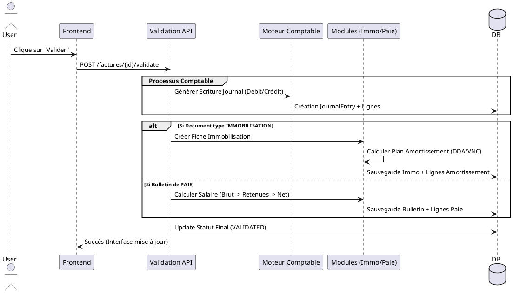
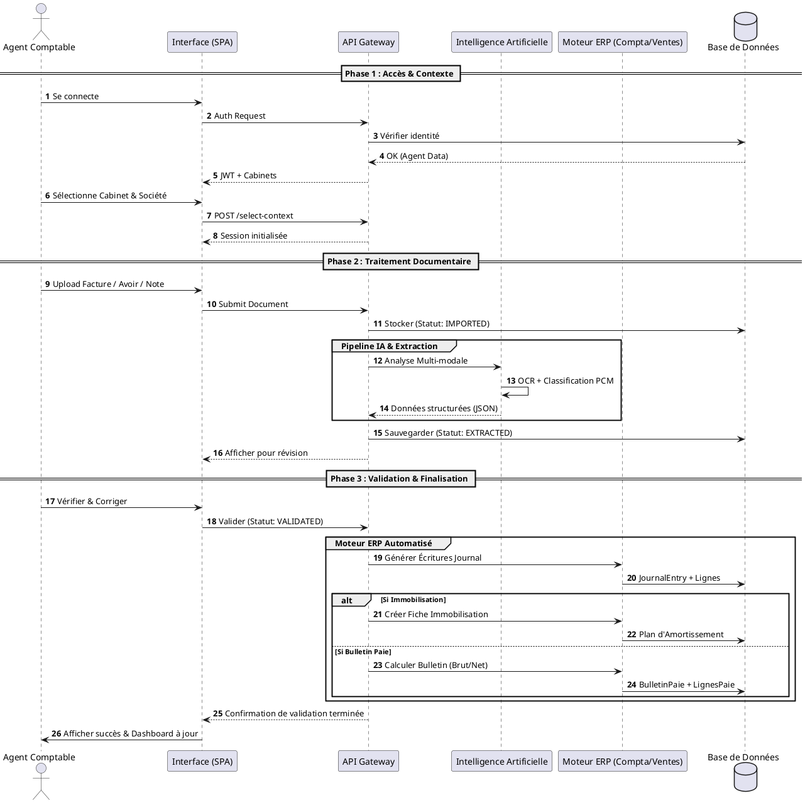

# Documentation Technique - Diagrammes PlantUML

Ce document regroupe les diagrammes de conception mis à jour pour l'application **Comptafacile**.

## 1. Diagramme de Cas d'Utilisation

Le système permet aux comptables (Agents) de gérer le flux complet de traitement des pièces comptables, de l'import à la génération des écritures.



---

## 2. Diagramme de Classe

Le schéma de données suit une architecture multi-tenant (Multi-Cabinet / Multi-Société).

```plantuml
@startuml
skinparam classAttributeIconSize 0
skinparam monochrome true
skinparam shadowing false

title Diagramme de Classes Complet (Multi-Tenant & ERP)

package "Structure Organisationnelle" {
    class Cabinet {
        + id : int
        + nom : string
        + email : string
        + telephone : string
        + adresse : string
        + logo_path : string
        + created_at : datetime
    }

    class Agent {
        + id : int
        + cabinet_id : int
        + username : string
        + email : string
        + password_hash : string
        + nom : string
        + prenom : string
        + is_active : boolean
        + is_admin : boolean
        + is_super_admin : boolean
        + created_at : datetime
        --
        + check_password(pwd) : bool
    }

    class Societe {
        + id : int
        + cabinet_id : int
        + raison_sociale : string
        + ice : string
        + if_fiscal : string
        + rc : string
        + patente : string
        + adresse : string
        + logo_path : string
        + created_at : datetime
        + updated_at : datetime
    }

    class agents_societes << (T,#FFAAAA) association >> {
        + agent_id : int <<FK>>
        + societe_id : int <<FK>>
    }
}

package "Traitement Factures & Avoirs" {
    class Facture {
        + id : int
        + societe_id : int
        + numero_facture : string
        + date_facture : date
        + due_date : date
        + invoice_type : string
        + supplier_name : string
        + supplier_ice : string
        + supplier_if : string
        + client_name : string
        + client_ice : string
        + montant_ht : numeric
        + montant_tva : numeric
        + montant_ttc : numeric
        + taux_tva : numeric
        + devise : string
        + payment_mode : string
        + status : string
        + extraction_source : string
        + ocr_confidence : numeric
        + dgi_flags : JSON
        + file_path : string
        + validated_by : string
        + validated_at : datetime
        + reject_reason : string
        + created_at : datetime
        + updated_at : datetime
        --
        + get_dgi_flags() : list
        + set_dgi_flags(flags) : void
    }

    class LigneFacture {
        + id : int
        + facture_id : int
        + description : text
        + quantity : numeric
        + unit_price_ht : numeric
        + line_amount_ht : numeric
        + tva_rate : numeric
        + pcm_account_code : string
        + pcm_account_label : string
        + corrected_account_code : string
        + classification_reason : string
    }
}

package "Comptabilité (PCM & Journal)" {
    class EcritureJournal {
        + id : int
        + facture_id : int
        + journal_code : string
        + entry_date : date
        + reference : string
        + description : text
        + total_debit : numeric
        + total_credit : numeric
        + is_validated : boolean
        + created_at : datetime
    }

    class LigneEcriture {
        + id : int
        + journal_entry_id : int
        + line_order : int
        + account_code : string
        + account_label : string
        + debit : numeric
        + credit : numeric
        + tiers_name : string
        + tiers_ice : string
    }

    class ComptePCM {
        + code : string
        + label : string
        + pcm_class : int
        + account_type : string
        + is_tva_account : boolean
    }
}

package "Immobilisations" {
    class Immobilisation {
        + id : int
        + societe_id : int
        + facture_id : int
        + designation : string
        + categorie : string
        + date_acquisition : date
        + valeur_acquisition : numeric
        + duree_amortissement : int
        + methode : string
        + statut : string
        --
        + generer_plan_amortissement() : void
    }

    class LigneAmortissement {
        + id : int
        + immobilisation_id : int
        + annee : int
        + dotation_annuelle : numeric
        + amortissement_cumule : numeric
        + valeur_nette_comptable : numeric
        + ecriture_generee : boolean
    }
}

package "Paie & RH" {
    class Employe {
        + id : int
        + societe_id : int
        + nom : string
        + prenom : string
        + cin : string
        + poste : string
        + date_embauche : date
        + salaire_base : numeric
        + nb_enfants : int
        + numero_cnss : string
        + statut : string
    }

    class BulletinPaie {
        + id : int
        + employe_id : int
        + mois : int
        + annee : int
        + salaire_base : numeric
        + prime_anciennete : numeric
        + autres_gains : numeric
        + salaire_brut : numeric
        + cnss_salarie : numeric
        + amo_salarie : numeric
        + ir_retenu : numeric
        + total_retenues : numeric
        + salaire_net : numeric
        + statut : string
        --
        + calculer_paie() : void
    }

    class LignePaie {
        + id : int
        + bulletin_id : int
        + libelle : string
        + type_ligne : string
        + montant : numeric
        + taux : numeric
    }
}

package "Audit & Utilitaires" {
    class ActionLog {
        + id : int
        + cabinet_id : int
        + agent_id : int
        + action_type : string
        + entity_type : string
        + entity_id : int
        + details : text
        + created_at : datetime
    }

    class CompteurFacturation {
        + id : int
        + societe_id : int
        + annee : int
        + dernier_numero : int
    }

    class MappingFournisseur {
        + id : int
        + cabinet_id : int
        + supplier_ice : string
        + pcm_account_code : string
        + usage_count : int
    }
}

' relations
Cabinet "1" *-- "0..*" Agent
Cabinet "1" *-- "0..*" Societe
Cabinet "1" *-- "0..*" ActionLog

Agent "1" -- "0..*" ActionLog
Agent "0..*" -- "0..*" agents_societes
Societe "1" -- "0..*" agents_societes

Societe "1" *-- "0..*" Facture
Societe "1" *-- "0..*" Immobilisation
Societe "1" *-- "0..*" Employe
Societe "1" *-- "0..*" CompteurFacturation
Cabinet "1" *-- "0..*" MappingFournisseur

Facture "1" *-- "0..*" LigneFacture
Facture "1" -- "0..1" EcritureJournal
Facture "1" -- "0..*" Immobilisation : origine

EcritureJournal "1" *-- "0..*" LigneEcriture
Immobilisation "1" *-- "0..*" LigneAmortissement

Employe "1" *-- "0..*" BulletinPaie
BulletinPaie "1" *-- "0..*" LignePaie
BulletinPaie "1" -- "0..1" EcritureJournal : génère

' Relations PCM
LigneEcriture "0..*" --> "1" ComptePCM
LigneFacture "0..*" --> "1" ComptePCM
MappingFournisseur "0..*" --> "1" ComptePCM

@enduml
```



---

## 3. Diagrammes de Séquence

### Séquence A : Authentification & Initialisation Multi-Tenant
Ce flux décrit l'accès sécurisé et la configuration du contexte de travail dynamique.



### Séquence B : Pipeline Intelligent de Traitement (Facture / Avoir)
Le flux automatisé de capture et d'analyse par l'intelligence artificielle.



### Séquence C : Validation Métier & Génération Automatisée (ERP)
Ce flux montre comment une validation déclenche les moteurs comptables spécialisés.



---

### Séquence D : Flux Global de l'Agent Comptable (Processus de Bout en Bout)
Ce diagramme synthétise le parcours complet d'un agent de la connexion jusqu'à l'aboutissement comptable des pièces.


```
